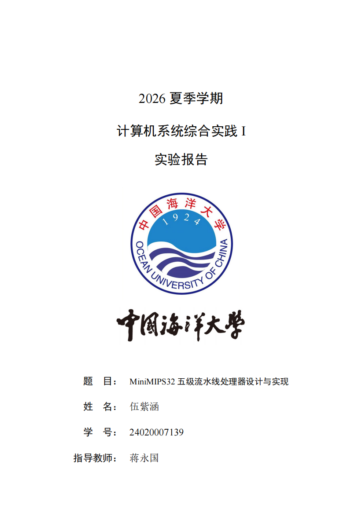
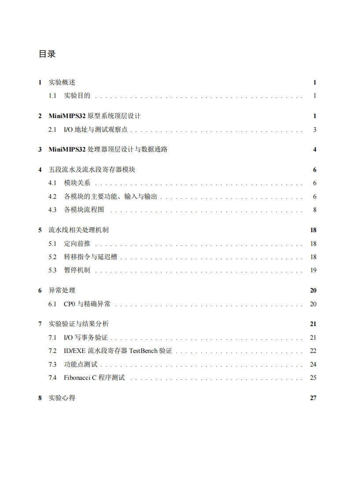
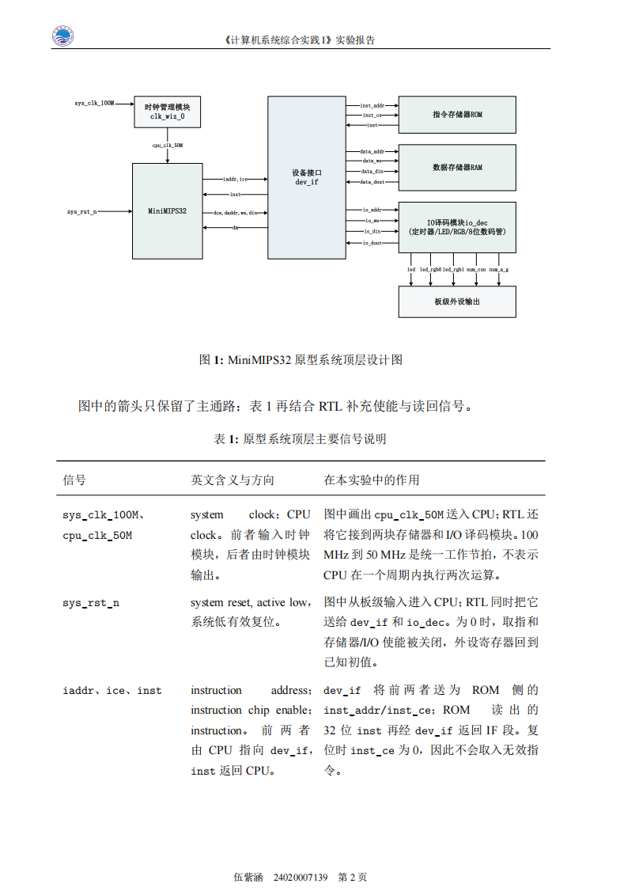

# 中国海洋大学 LaTeX 实验报告模板 或 论文模板

这是一个可直接复制使用的中文 LaTeX 实验报告模板。`main` 只保留模板、必要校徽资源、README 示例和编译检查；真实课程报告位于各自主题分支。

如果是其他学校或者其他组织的，可以把图片换为其图标来使用。

## 开始使用

1. 在 GitHub 选择 **Code → Download ZIP**，默认下载的就是 `main` 模板；或执行：

   ```bash
   git clone https://github.com/qiqiqisi/Latex_Used.git
   ```

2. 打开 `main.tex`，先替换文件顶部的六项占位内容：题目、课程名称、学期、姓名、学号、指导教师。
3. 使用 XeLaTeX 编译两次：

   ```bash
   xelatex main.tex
   xelatex main.tex
   ```

   也可将整个目录上传到 Overleaf，并将编译器设为 XeLaTeX。

4. 将灰色的“待填写”提示替换为自己的真实实验内容；删除不需要的占位图、表或章节。

## 模板效果示例

下列截图展示模板的封面、目录和正文排版效果。封面与正文包含报告作者的真实姓名、学号和页脚信息，已按作者明确授权原样公开。

### 封面



### 目录



### 正文



## 分支说明

下列分支每个只放一份按主题归类、已去除学生身份信息的历史报告源码及其必要资源；不包含生成 PDF、构建缓存或本地参考资料。旧文件未记录正式课程名，因此分支名采用可验证的报告主题，而不臆造课程名称。

| 分支 | 内容 |
| --- | --- |
| [`git-and-latex`](../../tree/git-and-latex) | Git 与 LaTeX 入门报告 |
| [`shell-and-vim`](../../tree/shell-and-vim) | Shell 与 Vim 报告 |
| [`command-line-and-python`](../../tree/command-line-and-python) | 命令行与 Python 报告 |
| [`matlab-spectral-analysis`](../../tree/matlab-spectral-analysis) | MATLAB 频谱分析报告 |
| [`data_structure`](../../tree/data_structure) | 数据结构与 GCN 报告 |
| [`computer-system-practice-report`](../../tree/computer-system-practice-report) | 计算机系统综合实践 I 报告 |

## 目录结构

```text
.
├── main.tex                 # 模板主文件
├── ouc.png                  # 可选学校标识
├── ouc_font.png             # 可选校名字标
├── docs/screenshots/        # README 的无身份信息示例图
├── .github/workflows/       # XeLaTeX 编译检查
├── .gitignore
└── README.md
```

